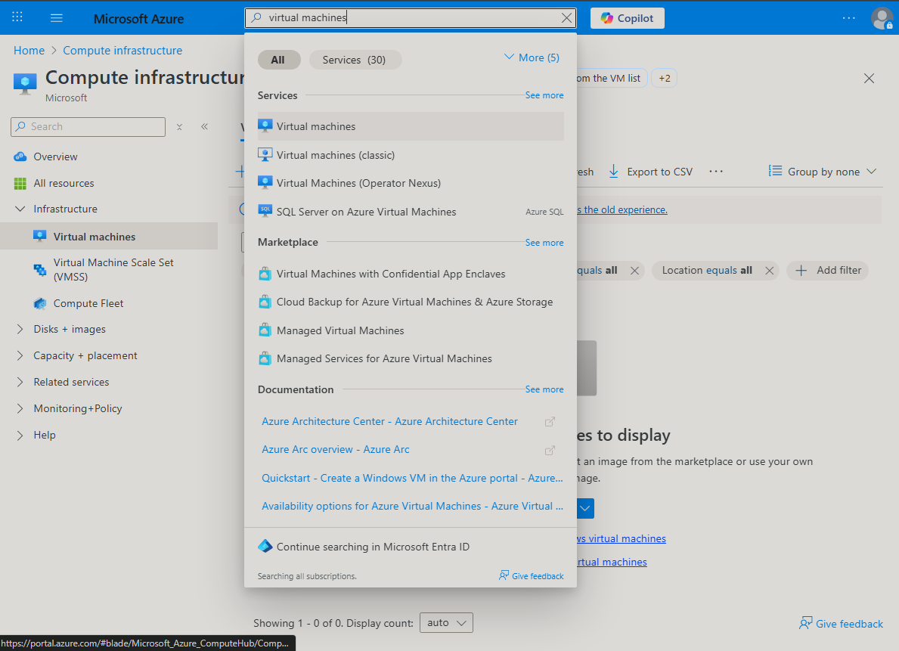
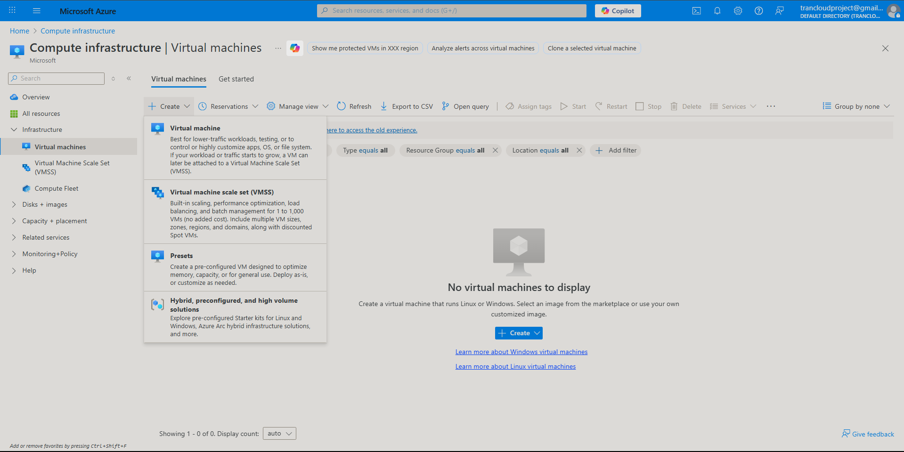
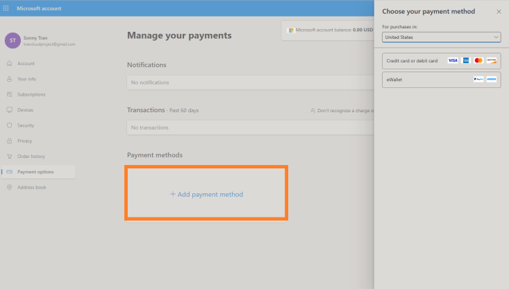
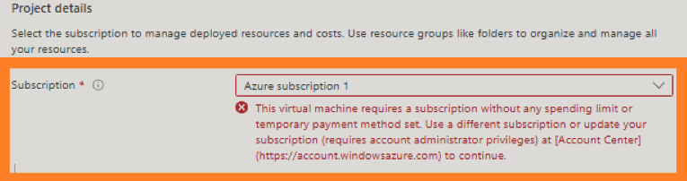

  

<h1 align="center">Azure Virtual Machine Lab</h1>

  A hands-on lab demonstrating how to create and access a Windows Virtual Machine using Microsoft Azure.

---

This repository documents my process of creating and accessing a Virtual Machine in Microsoft Azure.

## Prerequisites

Before starting this lab, make sure you have the following:

- A Microsoft Azure account  
- Internet connection  
- A computer running Windows 10/11  
- Remote Desktop Connection (RDP) installed — included by default on Windows  

## Technologies Used

This lab makes use of the following technologies and tools:

- Microsoft Azure Portal  
- Azure Virtual Machines (Compute)  
- Windows 11 (for the VM)  
- Remote Desktop Protocol (RDP)  
- Web browser (Microsoft Edge, Chrome, or similar)
  
## Creating the Virtual Machine

The following section outlines the process for creating a Windows Virtual Machine in Microsoft Azure.  
This includes selecting a resource group, choosing an operating system, configuring the VM size,  
and preparing login credentials that will later be used to access the machine via Remote Desktop.

### Step 1: Log Into the Azure Portal

Start by signing into the Microsoft Azure Portal.  
If you do not have an account yet, you can create one using Microsoft's free trial, which includes $200 in credits for the first 30 days.

  

### Step 2: Search for the Virtual Machines service

Once inside the Azure Portal, use the search bar at the top of the page.  
Type **“virtual machines”** and select **Virtual Machines** from the dropdown list.

  

### Step 3: Create a New Virtual Machine

After selecting **Virtual Machines** from the search results, you will be taken to the Virtual Machines dashboard.  
Here, click the blue **Create** button and choose **Azure virtual machine** from the dropdown menu.

  

### Step 4: Configure the Virtual Machine Basics

On the **Basics** tab, configure the core settings for your virtual machine.  
These fields determine the VM’s region, operating system, hardware size, and login credentials.

Key fields to complete:

- **Subscription**: Select your Azure subscription  
- **Resource Group**: Create a new one or select an existing group  
- **Virtual machine name**: Name your VM (e.g., *ExampleVM*)  
- **Region**: Choose a region near you  
- **Image**: Select the operating system (Windows 11 or Windows 10)  
- **Size**: Choose a VM size appropriate for testing (e.g., *Standard_B2s*)  
- **Administrator account**: Create your username and password  
- **Licensing**: Check the box to confirm Windows licensing requirements  

  

## ❗ FAQ — Why can't I create a Virtual Machine?

### 1. Azure requires a valid payment method
If you see this screen when trying to start your free trial, it means you have **not added a payment method yet**.

  

To fix this:
- Go to **account.microsoft.com**
- Navigate to **Payment options**
- Click **+ Add payment method**
- Add a debit card or credit card  
  *(You will NOT be charged—Azure only verifies the card)*

---

### 2. "This virtual machine requires a subscription without spending limit"
If Azure blocks you with this message:

  

It means your subscription is still in **restricted mode**, usually because:
- You **did not finish identity verification**, OR
- No **valid payment method** was added yet.

➡️ **Solution:**  
Add payment method → Wait 1–5 minutes → Refresh Azure VM page.

---

## Accessing the Virtual Machine (Windows 11)

To connect to your Azure Virtual Machine from a Windows 11 computer:

1. Open the **Start Menu**  
2. Type **Remote Desktop Connection**  
3. Select the RDP app (preinstalled on Windows 11)  
4. Enter the Public IP address of your Azure VM  
5. Authenticate using the username and password you created during VM setup
